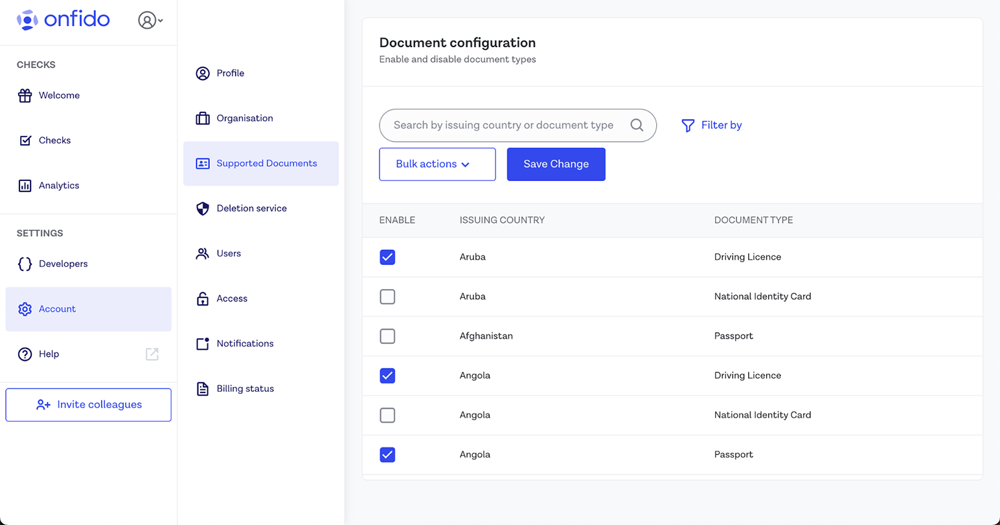

# Onfido Android SDK

[](https://search.maven.org/artifact/com.onfido.sdk.capture/onfido-capture-sdk/)


## Table of contents

* [Overview](#overview)
* [Getting started](#getting-started)
* [Handling callbacks](#handling-callbacks)
* [Custom Callbacks](#custom-callbacks)
* [Customizing the SDK](#customizing-the-sdk)
* [Dynamic Feature Module](#dynamic-feature-module)
* [Generating verification reports](#generating-verification-reports)
* [User Analytics](#user-analytics)
* [Going live](#going-live)
* [Cross platform frameworks](#cross-platform-frameworks)
* [Migrating](#migrating)
* [Security](#security)
* [Accessibility](#accessibility)
* [Licensing](#licensing)
* [More information](#more-information)
* [Raising support issues](#support)

## Overview

The Onfido Android SDK provides a drop-in set of screens and tools for Android applications to capture identity documents and selfie photos, videos and motion captures for the purpose of identity verification. 

It offers a number of benefits to help you create the best identity verification experience for your customers:

- Carefully designed UI to guide your customers through the entire photo, video or motion capture process
- Modular design to help you seamlessly integrate the photo, video or motion capture process into your application flow
- Advanced image quality detection technology to ensure the quality of the captured images meets the requirement of the Onfido identity verification process, guaranteeing the best success rate
- Direct image upload to the Onfido service, to simplify integration

⚠️ Note: The SDK is only responsible for capturing and uploading document photos, live selfies, live videos and motion captures. You still need to access the [Onfido API](https://documentation.onfido.com/) to manage applicants and [Onfido Studio](https://developers.onfido.com/guide/onfido-studio-product) to build verification workflows.


## Getting started

The SDK supports API level 21 and above ([distribution stats](https://developer.android.com/about/dashboards/index.html)).

[Version 7.4.0](https://github.com/onfido/onfido-android-sdk/releases/tag/7.4.0) was the last version that supported API level 16 and above.

Our configuration is currently set to the following:

- `minSdkVersion = 21`
- `targetSdkVersion = 31`
- `android.useAndroidX=true`
- `Kotlin = 1.7.10+`
```
  compileOptions {
    sourceCompatibility JavaVersion.VERSION_1_8
    targetCompatibility JavaVersion.VERSION_1_8
  }
```

⚠️ The following content assumes you're using our API v3 versions for backend calls. If you are currently using API v2 please refer to [this migration guide](https://developers.onfido.com/guide/api-v2-to-v3-migration-guide) for more information.
> ℹ️
>
> If you are integrating using Onfido Studio please see our** [Studio integration guide](ONFIDO_STUDIO.md)

### 1. Obtain an API token

In order to start integrating, you will need an [API token](https://documentation.onfido.com/#api-tokens).

You can use our [sandbox](https://documentation.onfido.com/#sandbox-testing) environment to test your integration. To use the sandbox, you'll need to generate a sandbox API token in your [Onfido Dashboard](https://onfido.com/dashboard/api/tokens).

⚠️ Note: You must never use API tokens in the frontend of your application or malicious users could discover them in your source code. You should only use them on your server.

#### 1.1 Regions

Onfido offers region-specific environments. Refer to the [Regions](https://documentation.onfido.com/#regions) section in our API documentation for token format and API base URL information.

### 2. Add the SDK dependency

Starting from version `4.2.0`, Onfido offers a modularized SDK. You can integrate it in 2 different ways:

1. `onfido-capture-sdk`
2. `onfido-capture-sdk-core`

#### 2.1 `onfido-capture-sdk`

This is the **recommended** integrated option.

This is a complete solution, focusing on input quality. It features advanced on-device, real-time glare and blur detection as well as auto-capture (passport only) on top of a set of basic image validations.

```gradle
repositories {
  mavenCentral()
}

dependencies {
  implementation 'com.onfido.sdk.capture:onfido-capture-sdk:x.y.z'
}
```

Due to the advanced validation support (in C++ code) we recommend that the integrator app performs [multi-APK split](#multi-apk-split) to optimize the app size for individual architectures.

Average size (with Proguard enabled):

| ABI         |   Size   |
|-------------|:--------:|
| armeabi-v7a | 13.30 Mb  |
| arm64-v8a   | 12.88 Mb |
| universal   | 40.13 Mb |

#### 2.2 `onfido-capture-sdk-core`

This is a lighter version. It provides a set of basic image validations, mostly completed on the backend. There are no real-time validations on-device for document capture.
However, since our face capture utilizes NDK for advanced face recognition and yaw calculation, we still recommend [multi-APK split](#multi-apk-split) to optimize the app size for individual architectures.


```gradle
repositories {
  mavenCentral()
}

dependencies {
  implementation 'com.onfido.sdk.capture:onfido-capture-sdk-core:x.y.z'
}
```

Average size (with Proguard enabled):

| ABI              |   Size   |
|------------------|:--------:|
| core-armeabi-v7a | 10.19 Mb  |
| core-arm64-v8a   | 9.97 Mb  |
| core-universal   | 14.82 Mb |


**Note**: The average sizes were measured by building the minimum possible wrappers around our SDK,
using the following [stack](https://github.com/bitrise-io/bitrise.io/blob/master/system_reports/linux-docker-android-lts.log).
Different versions of the dependencies, such as Gradle or NDK, may result in slightly different values.

⚠️ In order to improve the security of our clients, we upgraded our infrastructure and SDK client SSL configurations to support TLSv1.2 only.
According to the relevant [Google documentation](https://developer.android.com/reference/javax/net/ssl/SSLSocket.html), this support comes enabled by default on every device running Android API 20+.
If you need to support older devices, we need to access Google Play Services to install the latest security updates which enable this support.
If you don't use Google Play Services on your integration yet, we require you to add the following dependency:

```gradle
compile ('com.google.android.gms:play-services-base:x.y.z') {
           exclude group: 'com.android.support' // to avoid conflicts with your current support library
}
```

##### Multi-APK split

C++ code needs to be compiled for each of the CPU architectures (known as "ABIs") present on the Android environment. Currently, the SDK supports the following ABIs:

* `armeabi-v7a`: Version 7 or higher of the ARM processor. Most recent Android phones use this
* `arm64-v8a`: 64-bit ARM processors. Found on new generation devices
* `x86`: Most tablets and emulators
* `x86_64`: Used by 64-bit tablets

The SDK binary contains a copy of the native `.so` file for each of these four platforms.
You can considerably reduce the size of your `.apk` by applying APK split by ABI, editing your `build.gradle` to the following:

```gradle
android {

  splits {
    abi {
        enable true
        reset()
        include 'x86', 'x86_64', 'arm64-v8a', 'armeabi-v7a'
        universalApk false
    }
  }
}
```
Read the [Android documentation](http://tools.android.com/tech-docs/new-build-system/user-guide/apk-splits) for more information.

### 3. Create an applicant

To create an applicant from your backend server, make a request to the ['create applicant' endpoint](https://documentation.onfido.com/#create-applicant), using a valid API token.

**Note**: Different report types have different minimum requirements for applicant data. For a Document or Facial Similarity report the minimum applicant details required are `first_name` and `last_name`.

```shell
$ curl https://api.onfido.com/v3/applicants \
    -H 'Authorization: Token token=<YOUR_API_TOKEN>' \
    -d 'first_name=John' \
    -d 'last_name=Smith'
```

The JSON response will return an `id` field containing a UUID that identifies the applicant. Once you pass the applicant ID to the SDK, documents, photos, videos and motion captures uploaded by that instance of the SDK will be associated with that applicant.

### 4. Configure the SDK with a token

You'll need to generate and include an SDK token every time you initialize the SDK.
To generate an SDK token, make a request to the ['generate SDK token' endpoint](https://documentation.onfido.com/#generate-web-sdk-token).

```shell
$ curl https://api.onfido.com/v3/sdk_token \
  -H 'Authorization: Token token=<YOUR_API_TOKEN>' \
  -F 'applicant_id=<YOUR_APPLICANT_ID>' \
  -F 'application_id=<YOUR_APPLICATION_ID>'
```

| Parameter           |  Notes   |
| ------------ | --- |
| `applicant_id` | **required** <br /> Specifies the applicant for the SDK instance. |
| `application_id` | **required** <br /> The application ID that was set up during development. For Android, this is usually in the form `com.example.yourapp`. Make sure to use a valid `application_id` or you'll receive a 401 error. |

⚠️ SDK tokens expire after 90 minutes.

##### 4.1 `tokenExpirationHandler`

You can use the optional `tokenExpirationHandler` parameter in the SDK token configurator function to generate and pass a new SDK token when it expires. This ensures the SDK continues its flow even after an SDK token has expired. You should inject a new token in 10 seconds after the callback is triggered, else flow will finish with `TokenExpiredException` error.

For example:

##### Kotlin

```kotlin

class ExpirationHandler : TokenExpirationHandler {

        override fun refreshToken(injectNewToken: (String?) -> Unit) {
            TODO("<Your network request logic to retrieve SDK token goes here>")
            injectNewToken("<NEW_SDK_TOKEN>") // if you pass `null` the sdk will exit with token expired error
        }
    }

val config = OnfidoConfig.builder(context)
    .withSDKToken("<YOUR_SDK_TOKEN_HERE>", tokenExpirationHandler = ExpirationHandler()) // ExpirationHandler is optional
```

##### Java

```java

class ExpirationHandler implements TokenExpirationHandler {

    @Override
    public void refreshToken(@NotNull Function1<? super String, Unit> injectNewToken) {
        //Your network request logic to retrieve SDK token goes here
        injectNewToken.invoke("<NEW_SDK_TOKEN>"); // if you pass `null` the sdk will exit with token expired error
    }
}

OnfidoConfig.Builder config = new OnfidoConfig.Builder(context)
                .withSDKToken("<YOUR_SDK_TOKEN>", new ExpirationHandler()); // ExpirationHandler is optional
```


### 5. Instantiate the client

To use the SDK, you need to obtain an instance of the client object.

```java
final Context context = ...;
Onfido onfido = OnfidoFactory.create(context).getClient();
```

### 6. Custom Application Class
**Note**: You can skip this step if you don't have any custom application class.

⚠️ After the release of version 17.0.0, Onfido Android SDK runs in a separate process. This means that when the Onfido SDK gets started, a new application instance will be created. To prevent re-executing the initializations you have in the Android application class, you can use the `isOnfidoProcess` extension function and return from `onCreate` as shown below:

This will prevent initialization-related crashes such as: [`FirebaseApp is not initialized in this process`](https://github.com/firebase/firebase-android-sdk/issues/4693)

The `isOnfidoProcess` extension function has been integrated into the Application class to prevent accidental reinitialization of instances within custom application classes. This feature is especially useful for optimizing the Onfido initialization process. Be aware that the Onfido process uses your custom Application class for its own initialization. If you decide to use `isOnfidoProcess` to selectively skip the initialization of certain instances during the Onfido process, be cautious not to access these uninitialized instances elsewhere in your Application class, such as in the `onTrimMemory` method, to avoid unexpected behavior. Furthermore, instances initialized by providers like Firebase will not be reinitialized in the Onfido process. If you wish to use such instances within the Onfido process, you'll need to manually initialize them. More info can be found [here](https://firebase.google.com/docs/reference/android/com/google/firebase/FirebaseApp#initializeApp(android.content.Context)).

##### Kotlin

```kotlin
class YourCustomApplication : MultiDexApplication() {
	override fun onCreate() {
	    super.onCreate()
	    if (isOnfidoProcess()) {
	        return
	    }
	    
	    // Your custom initialization calls ...
	 }
}

```

##### Java

```java
public class YourCustomApplication extends MultiDexApplication {
    @Override
    public void onCreate() {
        super.onCreate();
        if (Onfido.Companion.isOnfidoProcess(this)) {
            return;
        }

        // Your custom initialization calls ...
    }
}
```

### 7. Start the flow

```java
// start the flow. 1 should be your request code (customize as needed)
onfido.startActivityForResult(this,         /*must be an Activity or Fragment (support library)*/
                              1,            /*this request code will be important for you on onActivityResult() to identify the onfido callback*/
                              config);
```

## Handling callbacks

To receive the result from the flow, you should override the method `onActivityResult` on your Activity or Fragment. Typically, on success, you would [create a check](#creating-checks) on your backend server.

```java
@Override
protected void onActivityResult(int requestCode, int resultCode, Intent data) {
    ...
    onfido.handleActivityResult(resultCode, data, new Onfido.OnfidoResultListener() {
        @Override
        public void userCompleted(Captures captures) {
        }

        @Override
        public void userExited(ExitCode exitCode) {
        }

        @Override
        public void onError(OnfidoException exception) {
        }
    });
}
```

| Attribute     |    Notes    |
| -----|-------|
| `userCompleted` | User completed the flow. You can now [create a check](#creating-checks) on your backend server. The `captures` object contains information about the document and face captures made during the flow.|
| `userExited` | User left the SDK flow without completing it. Some images may have already been uploaded. The `exitCode` object contains information about the reason for exit. |
| `onError` | Some error happened. |

**`captures`**

Sample of a `captures` instance returned by a flow with `FlowStep.CAPTURE_DOCUMENT`, `FlowStep.CAPTURE_FACE` and  `FlowStep.PROOF_OF_ADDRESS`:
```
Document:
        Front: DocumentSide(id=document_id, side=FRONT, type=DRIVING_LICENCE, nfcSupported=false)
        Back: DocumentSide(id=document_id, side=BACK, type=DRIVING_LICENCE, nfcSupported=false)
        Type: DRIVING_LICENCE
            
Face:
        Face(id=face_id, variant=PHOTO) 
        
Proof of address:
        Poa(id=poa_id, type=UTILITY_BILL, issuing_country=UK)    
```
**Note**: `type` property refers to `DocumentType`, variant refers to `FaceCaptureVariant`

**Note**: As part of `userCompleted` method, the `DocumentType` property can only contain the values which are supported by Onfido API. Please check out [our API documentation](https://documentation.onfido.com/#document-types)

**`exitCode`**

Potential `exitCode` reasons:

| `exitCode`                            |
| ------------------------------------- |
| USER_LEFT_ACTIVITY                    |
| USER_CONSENT_DENIED                   |
| CAMERA_PERMISSION_DENIED (Deprecated) |


## Customizing the SDK

You can also read our [SDK customization guide](https://developers.onfido.com/guide/sdk-customization).

### Flow customization

You can customize the flow of the SDK via the `withCustomFlow(FlowStep[])` method. You can remove, add and shift around steps of the SDK flow.

```java
final FlowStep[] defaultStepsWithWelcomeScreen = new FlowStep[]{
    FlowStep.WELCOME,                       //Welcome step with a step summary, optional
    FlowStep.CAPTURE_DOCUMENT,              //Document capture step
    FlowStep.CAPTURE_FACE,                  //Face capture step
    FlowStep.PROOF_OF_ADDRESS,              //Proof of address capture step
    FlowStep.FINAL                          //Final screen step, optional
};

final OnfidoConfig config = OnfidoConfig.builder()
    .withCustomFlow(defaultStepsWithWelcomeScreen)
    .withSDKToken("<YOUR_SDK_TOKEN>")
    .build();
```

#### Exiting the flow

You can call the `exitWhenSentToBackground()` method of the `OnfidoConfig.Builder`, to automatically exit the flow if the user sends the app to background.
This exit action will invoke the [`userExited(ExitCode exitCode)` callback](#handling-callbacks).

#### Welcome step

The welcome screen displays a summary of the capture steps the user will pass through. These steps can be specified to match the flow required. This is an optional screen.

#### Consent step

This step contains a screen to collect US end users' privacy consent for Onfido. It contains the consent language required when you offer your service to US users as well as links to Onfido's policies and terms of use. This is an optional screen.

The user must click "Accept" to move past this step and continue with the flow. The content is available in English only, and is not translatable.

⚠️ This step doesn't automatically inform Onfido that the user has given their consent. At the end of the SDK flow, you still need to set the API parameter `privacy_notices_read_consent_given` outside of the SDK flow when [creating a check](#creating-checks).

If you choose to disable this step, you must incorporate the required consent language and links to Onfido's policies and terms of use into your own application's flow before your end user starts interacting with the Onfido SDK.

For more information about this step, and how to collect user consent, please visit [Onfido Privacy Notices and Consent](http://developers.onfido.com/guide/onfido-privacy-notices-and-consent).

#### Document capture step

In the Document Capture step, an end user can select the issuing country and document type before capture. In a very limited number of cases, the end user may also be asked if they have a card or paper version of their document.

This information is used to optimize the capture experience, as well as inform the end user about which documents they are allowed to use.

This selection screen is optional, and will be automatically hidden where the end user is not required to indicate which document will be captured.

You can specify allowed issuing countries and document types for the document capture step in one of three ways: 
*   If you are using Onfido Studio, this is configured within a Document Capture task, documented in the [Studio Product Guide](https://developers.onfido.com/guide/onfido-studio-product#document-capture-task)
*   Otherwise, for Onfido Classic you can set this globally in your Dashboard (recommended), or hard code it into your SDK integration. Both of these options are documented below.

##### Country and document type selection by Dashboard 

Configuring the issuing country and document type selection step using your Dashboard is the **recommended method** of integration (available from [iOS SDK](https://documentation.onfido.com/sdk/ios/) version 28.0.0 and [Android SDK](https://documentation.onfido.com/sdk/android/) version 16.0.0 onwards) as this configuration is also applied to your Document Reports. Any document that has been uploaded by an end user against your guidance will result in a Document Report sub-result of "rejected" and be flagged as `Image Integrity` > `Supported Document`.

_We will be rolling out Dashboard-based configuration of allowed documents soon. In the meantime, contact [support@onfido.com](support@onfido.com) or your Customer Support Manager to request access to this feature_.

*   Open the Accounts tab on your [Dashboard](https://dashboard.onfido.com/), then click Supported Documents
*   You will be presented with a list of all available countries and their associated supported documents. Make your selection, then click Save Change. 



**Please note the following SDK behaviour**:
*   Hard coding any document type and issuing country configuration in your SDK integration will fully override the Dashboard-based settings
*   Currently, only passport, national ID card, driving licence and residence permit are visible for document selection by the end user in the SDK. For the time being, if you nominate other document types in your Dashboard (visa, for example), these will not be displayed in the user interface
*   If you need to add other document types to the document selection screen, you can mitigate this limitation in the near-term, using the Custom Document feature
*   If for any reason the configuration fails or is not enabled, the SDK will fallback to display the selection screen for the complete list of documents supported within the selection screens

##### Country and document type customization by SDK integration code

You can configure the document step to capture single document types with specific properties, as well as customize the screen to display only a limited list of document types using the `DocumentCaptureStepBuilder` class's functions for the corresponding document types.

| Document Type           | Configuration function  | Configurable Properties        |
| ----------------------- | ----------------------- | ----------------------------   |
| Passport                | forPassport()           |                                |
| National Identity Card  | forNationalIdentity()   | - country<br> - documentFormat |
| Driving Licence         | forDrivingLicence()     | - country<br> - documentFormat |
| Residence Permit        | forResidencePermit()    | - country                      |
| Visa                    | forVisa()               | - country                      |
| Work Permit             | forWorkPermit()         | - country                      |
| Generic                 | forGenericDocument()    | - country<br> - documentPages  |

**Note** `GENERIC` document type doesn't offer an optimised capture experience for a desired document type.

- **Document type**

The list of document types visible for the user to select can be shown or hidden using this option. If only one document type is specified, users will not see the selection screen and will be taken directly to the capture screen. Please see a more detailed guide [here](https://documentation.onfido.com/sdk/android/#document-capture-step).

Each document type has its own configuration class.

##### Customizing the issuing country and document type selection screen with pre-selected documents

You can also customize the screen to display only a limited list of document types, using the configuration function to specify the ones you want to show.

⚠️ Currently you can only include `PASSPORT`, `NATIONAL_IDENTITY_CARD`, `DRIVING_LICENCE`, `RESIDENCE_PERMIT` in the list.

For example, to hide the Driving Licence Document type:

##### Java

```java
List<DocumentType> documentTypes = new ArrayList<>();
documentTypes.add(DocumentType.PASSPORT);
documentTypes.add(DocumentType.NATIONAL_IDENTITY_CARD);
documentTypes.add(DocumentType.RESIDENCE_PERMIT);

onfidoConfigBuilder.withAllowedDocumentTypes(documentTypes);
```

##### Kotlin

```kotlin
val documentTypes = listOf(
    DocumentType.PASSPORT,
    DocumentType.NATIONAL_IDENTITY_CARD,
    DocumentType.RESIDENCE_PERMIT
)

onfidoConfigBuilder.withAllowedDocumentTypes(documentTypes)
```

- **Document country**

The configuration function allows you to specify the document's country of origin. If a document country is specified for a document type, the selection screen is displayed with preselected country.

**Note**: You can specify country for all document types except `PASSPORT`. This is because passports have the same format worldwide so the SDK does not require this additional information.     

For example to only capture UK driving licences:

##### Java

```Java
FlowStep drivingLicenceCaptureStep = DocumentCaptureStepBuilder.forDrivingLicence()
                .withCountry(CountryCode.GB)
                .build();
```

##### Kotlin

```kotlin
val drivingLicenceCaptureStep = DocumentCaptureStepBuilder.forDrivingLicence()
                .withCountry(CountryCode.GB)
                .build()
```

- **Document format**

You can specify the format of a document as `CARD` or `FOLDED`. `CARD` is the default document format value for all document types.

If `FOLDED` is configured a specific template overlay is shown to the user during document capture.

**Note**: You can specify `FOLDED` document format for French driving licence, South African national identity and Italian national identity only. If you configure the SDK with an unsupported
document format the SDK will throw a `InvalidDocumentFormatAndCountryCombinationException`.

For example to only capture folded French driving licences:

##### Java

```java
FlowStep drivingLicenceCaptureStep = DocumentCaptureStepBuilder.forDrivingLicence()
                .withCountry(CountryCode.FR)
                .withDocumentFormat(DocumentFormat.FOLDED)
                .build();
```

##### Kotlin

```kotlin
val drivingLicenceCaptureStep = DocumentCaptureStepBuilder.forDrivingLicence()
                .withCountry(CountryCode.FR)
                .withDocumentFormat(DocumentFormat.FOLDED)
                .build()
```

⚠️ Not all document - country combinations are supported. Unsupported documents will not be verified. If you decide to bypass the default country selection screen by replacing the `FlowStep.CAPTURE_DOCUMENT` with a `CaptureScreenStep`, please make sure that you are specifying a supported document.
We provide an up-to-date list of our [supported documents](https://onfido.com/supported-documents/).

#### Face capture step

In this step a user can use the front camera to capture their face in the form of photo, video or motion capture.

The Face step has 3 variants:
1. To configure for photo use `FaceCaptureStepBuilder.forPhoto()`.
2. To configure for video use `FaceCaptureStepBuilder.forVideo()`.
3. To configure for motion use `FaceCaptureStepBuilder.forMotion()`.

**Motion**

Motion supports audio recording, but it is disabled by default. In order to enable it use `.withAudio(true)`.

```java
FlowStep faceCaptureStep = FaceCaptureStepBuilder.forMotion()
                .withAudio(true)
                .build();
```

**Introduction screen**

By default all variants show an introduction screen. This is an optional screen only for face variant. You can disable it using the `withIntro(false)` function.

```java
FlowStep faceCaptureStep = FaceCaptureStepBuilder.forPhoto()
                .withIntro(false)
                .build();
```

Please note that you can only hide the intro video (not the whole screen) in video variant by using the `withIntro(false)` function.

Customization of introduction screen for motion variant is not available.

**Confirmation screen**

By default both face and video variants show a confirmation screen. To not display the recorded video on the confirmation screen, you can hide it using the `withConfirmationVideoPreview` function.

```java
FlowStep faceCaptureStep = FaceCaptureStepBuilder.forVideo()
                .withConfirmationVideoPreview(false)
                .build();
```

**Errors**

The Face step can be configured to allow only for one variant. A custom flow **cannot** contain multiple variants of the face capture. If more than one type of `FaceCaptureStep` are added to the same custom flow, a custom `IllegalArgumentException` will be thrown at the beginning of the flow,
with the message `"You are not allowed to define more than one FaceCaptureVariant in a flow."`.

#### Proof of address step

In the Proof of Address step, a user picks the issuing country and type of document that proves their address before capturing the document with their phone camera or uploading it.

#### Finish step

The final screen displays a completion message to the user and signals the end of the flow. This is an optional screen.

#### NFC capture

Recent passports, national identity cards and residence permits contain a chip that can be accessed using Near Field Communication (NFC).
The Onfido SDKs provide a set of screens and functionalities to extract this information, verify its authenticity and provide the results as part of a Document report.
With version [18.1.0] of the Onfido Android SDK, NFC is enabled by default and offered to customer when both the document and the device support NFC.

For more information on how to configure NFC and the list of supported documents, please refer to the [NFC for Document Report](https://developers.onfido.com/guide/document-report-nfc) guide.

##### Disabling NFC and excluding dependencies

As NFC is enabled by default and library dependencies are included in the build automatically, the following section details the steps required to disable NFC and remove any libraries from the build process:

Call `disableNFC()` while configuring `OnfidoConfig`:

```kotlin
val config = OnfidoConfig.builder(this@MainActivity)
    .withSDKToken(“<YOUR_SDK_TOKEN_HERE>”)
    .disableNFC() //Disable NFC feature
    .withCustomFlow(flowSteps)
    .build()
```

Exclude dependencies required for NFC from your build:

```gradle
dependencies {
  implementation 'com.onfido.sdk.capture:onfido-capture-sdk:x.y.z' {
    exclude group: 'net.sf.scuba', module: 'scuba-sc-android'
    exclude group: 'org.jmrtd', module: 'jmrtd'
    exclude group: 'com.madgag.spongycastle', module: 'prov'
  }
}
```

If your application already uses the same libraries that the Onfido SDK needs for the NFC feature, you may encounter some dependency conflicts that will impact and could interfere with the NFC capture in our SDK. In such cases, we propose using the dependency resolution strategy below, by adding the following lines to your `build.gradle` file:

```gradle
implementation ("com.onfido.sdk:onfido-<variant>:19.1.0"){
     exclude group: "org.bouncycastle"
 }
 implementation ("the other library that conflicts with Onfido on BouncyCastle") {
     exclude group: "org.bouncycastle"
 }
 
 implementation "org.bouncycastle:bcprov-jdk15to18:1.69"
 implementation "org.bouncycastle:bcutil-jdk15to18:1.69"
```

### UI customization

For visualizations of the available options please see our [SDK customization guide](https://developers.onfido.com/guide/sdk-customization#android).

#### Dark theme

Starting from version 19.1.0, Onfido SDK supports the dark theme. By default, the user's active device theme will be 
automatically applied to the Onfido SDK. However, you can opt out from dynamic theme switching at run time 
and instead set a theme statically at the build time as shown below. In this case, the flow will always be in displayed 
in the selected theme regardless of the user's device theme.

To force select dark theme:

```kotlin
onfidoConfigBuilder.withTheme(OnfidoTheme.DARK)
```

To force select light theme:

```kotlin
onfidoConfigBuilder.withTheme(OnfidoTheme.LIGHT)
```

#### Appearance and Colors

You can customize colors and other appearance attributes by overriding Onfido themes (`OnfidoActivityTheme` 
and `OnfidoDarkTheme`) in your `themes.xml` or `styles.xml`.
Make sure to set `OnfidoBaseActivityTheme` as the parent of `OnfidoActivityTheme` and  `OnfidoBaseDarkTheme` as the parent of `OnfidoDarkTheme` in your style definition.
All colors referenced in the themes should be defined in your `colors.xml`.  Alternatively, you can use hexadecimal 
color values directly in the themes. When customising fonts, all referenced fonts must be added to your project first. 
Further instructions for adding fonts can be found 
[here](https://developer.android.com/develop/ui/views/text-and-emoji/fonts-in-xml).   

For instance, you can add these themes to your `themes.xml` to change the toolbar background and primary buttons' 
color:

```xml
<!-- Light theme -->
<style name="OnfidoActivityTheme" parent="OnfidoBaseActivityTheme">
    <item name="onfidoColorToolbarBackground">@color/brand_dark_blue</item>
    <item name="onfidoColorActionMain">@color/brand_accent_color</item>
</style>

<!-- Dark theme -->
<style name="OnfidoDarkTheme" parent="OnfidoBaseDarkTheme">
    <item name="onfidoColorToolbarBackground">@color/brand_dark_blue</item>
    <item name="onfidoColorActionMain">@color/brand_accent_color</item>
</style>
```

The following attributes are currently supported:

* **Colors**
    * General
        * `onfidoColorBackground`: Background color of the non-capture screens
        * `colorAccent`: Defines alert dialogs' accent color, and text input fields' focused underline, cursor, and floating label color
    * Content
        * `onfidoColorContentMain`: Color of primary texts on screen, e.g. titles and regular body texts
        * `onfidoColorContentMainDark`: Color of the content on capture screens (those with dark backgrounds)
        * `onfidoColorContentSecondary`: Color of secondary texts on screen, e.g. subtitles
        * `onfidoColorContentNegative`: Color of error texts
    * Main buttons
        * `onfidoColorActionMain`: Background color of primary buttons
        * `onfidoColorActionMainPressed`: Background color of primary buttons when pressed
        * `onfidoColorActionMainDisabled`: Background color of primary buttons when disabled
        * `onfidoColorContentOnAction`: Text color of primary buttons
        * `onfidoColorContentOnActionDisabled`: Text color of primary buttons when disabled
    * Secondary buttons
        * `onfidoColorActionSecondary`: Background color of secondary buttons
        * `onfidoColorActionSecondaryPressed`: Background color of secondary buttons when pressed
        * `onfidoColorActionSecondaryDisabled`: Background color of secondary buttons when disabled
        * `onfidoColorContentOnActionSecondary`: Text color of secondary buttons
        * `onfidoColorContentOnActionSecondaryDisabled`: Text color of secondary buttons when disabled
        * `onfidoColorActionSecondaryBorder`: Border of the secondary buttons
        * `onfidoColorActionSecondaryBorderDisabled`: Border of the secondary buttons when disabled
    * Disclaimers
        * `onfidoColorDisclaimerBackground`: Background color of disclaimer boxes
        * `onfidoColorContentDisclaimer`: Text color of disclaimer boxes
        * `onfidoColorIconDisclaimer`: Icon color of disclaimer boxes
    * Toolbar and status bar
        * `onfidoColorToolbarBackground`: Background color of the `Toolbar` which guides the user through the flow
        * `colorPrimaryDark`: Color of the status bar (with system icons) above the `Toolbar`
        * `onfidoColorContentToolbarTitle`: Color of the `Toolbar`'s title text
    * Icons
        * `onfidoColorIconStroke`: Stroke color of icons
        * `onfidoColorIconStrokeNegative`: Stroke color for error icons
        * `onfidoColorIconFill`: Fill color of icons
        * `onfidoColorIconBackground`: Background color of icons
        * `onfidoColorIconAccent`: Background color of accented icons
        * `onfidoColorWatermark`: Color of the Onfido logo and co-brand logo in the footer of screens
        * `onfidoColorWatermarkDark`: Color of the Onfido logo and co-brand logo in the footer of capture screens
    * Spinner / progress indicator
        * `onfidoColorProgressTrack`: Track color of progress indicators (background color)
        * `onfidoColorProgressIndicator`: Indicator color of progress indicators (foreground color)

#### Widgets

You can customize the appearance of some widgets in your `dimens.xml` file by overriding:

* `onfidoButtonCornerRadius`: Defines the radius dimension of all the corners of primary and secondary buttons

#### Typography

You can customize the fonts by providing [font XML resources](https://developer.android.com/guide/topics/ui/look-and-feel/fonts-in-xml) to the theme by setting `OnfidoActivityTheme` to one of the following:

* `onfidoFontFamilyTitleAttr`: Defines the `fontFamily` attribute that is used for text which has typography type `Title`

* `onfidoFontFamilyBodyAttr`: Defines the `fontFamily` attribute that is used for text which has typography type `Body`

* `onfidoFontFamilySubtitleAttr`: Defines the `fontFamily` attribute that is used for text which has typography type `Subtitle`

* `onfidoFontFamilyButtonAttr`: Defines the `fontFamily` attribute that is applied to all primary and secondary buttons

* `onfidoFontFamilyToolbarTitleAttr`: Defines the `fontFamily` attribute that is applied to the title and subtitle displayed inside the `Toolbar`

* `*onfidoFontFamilyDialogButtonAttr`: Defines the `fontFamily` attribute that is applied to the buttons inside `AlertDialog` and `BottomSheetDialog`

For example:

In your application's `styles.xml`:
```xml
<style name="OnfidoActivityTheme" parent="OnfidoBaseActivityTheme">
        <item name="onfidoFontFamilyTitle">@font/montserrat_semibold</item>
        <item name="onfidoFontFamilyBody">@font/font_montserrat</item>

        <!-- You can also make the dialog buttons follow another fontFamily like a regular button -->
        <item name="onfidoFontFamilyDialogButton">?onfidoFontFamilyButton</item>

        <item name="onfidoFontFamilySubtitle">@font/font_montserrat</item>
        <item name="onfidoFontFamilyButton">@font/font_montserrat</item>
        <item name="onfidoFontFamilyToolbarTitle">@font/font_montserrat_semibold</item>
</style>
```

### Localization

The SDK supports and maintains the following 44 languages:

- Arabic: ar
- Armenian: hy
- Bulgarian: bg
- Chinese (Simplified): zh_rCN
- Chinese (Traditional): zh_rTW
- Croatian: hr
- Czech: cs
- Danish: da🇰
- Dutch: nl🇱
- English (United Kingdom): en_rGB
- English (United States): en_rUS
- Estonian: et
- Finnish: fi
- French (Canadian): fr_rCA
- French: fr
- German: de
- Greek: el
- Hebrew: iw
- Hindi: hi
- Hungarian: hu
- Indonesian: in
- Italian: it
- Japanese: ja
- Korean: ko
- Latvian: lv
- Lithuanian: lt
- Malay: ms
- Norwegian bokmål: nb
- Norwegian nynorsk: nn
- Persian: fa
- Polish: pl
- Portuguese (Brazil): pt_rBR
- Portuguese: pt
- Romanian: ro
- Russian: ru
- Serbian: sr
- Slovak: sk
- Slovenian: sl
- Spanish (Latin America): es_rUS
- Spanish: es
- Swedish: sv
- Thai: th
- Turkish: tr
- Ukrainian: uk
- Vietnamese: vi

**Custom language**

The Android SDK also allows for the selection of a specific custom language for locales that Onfido does not currently support. You can have an additional XML strings file inside your resources folder for the desired locale (for example, `res/values-it/onfido_strings.xml` for 🇮🇹 translation), with the content of our [strings.xml](strings.xml) file, translated for that locale.

When adding custom translations, please make sure you add the whole set of keys we have on [strings.xml](strings.xml). 

By default, we infer the language to use from the device settings. However, you can also use the `withLocale(Locale)` method of the `OnfidoConfig.Builder` to select a specific language.

**Note**: If the strings translations change it will result in a minor version change. If you have custom translations you're responsible for testing your translated layout.

If you want a locale translated you can get in touch with us at [android-sdk@onfido.com](mailto:android-sdk@onfido.com).

## Custom Callbacks

### Media Callbacks

#### Introduction
Onfido provides the possibility to integrate with our Smart Capture SDK, without the requirement of using this data only through the Onfido API. Media callbacks enable you to control the end user data collected by the SDK after the end user has submitted their captured media. As a result, you can leverage Onfido’s advanced on-device technology, including image quality validations, while still being able to handle end users’ data directly. This unlocks additional use cases, including compliance requirements and multi-vendor configurations, that require this additional flexibility.
This feature must be enabled for your account. Please contact your Onfido Solution Engineer or Customer Success Manager.

#### Implementation
To use this feature use `.withMediaCallback` and provide the callbacks for `DocumentResult`, `SelfieResult` and `LivenessResult`. ⚠️ From version 18.0.0 onwards, for any usage of the `MediaCallback`, implement `Parcelable` instead of `Serializable`.

##### Java
```java
onfidoConfigBuilder.withMediaCallback(new CustomMediaCallback());
private static class CustomMediaCallback implements MediaCallback {

    @Override
    public void onMediaCaptured(@NonNull MediaResult result) {
        if (result instanceof DocumentResult) {
            // Your callback code here
        } else if (result instanceof LivenessResult) {
            // Your callback code here
        } else if (result instanceof SelfieResult) {
            // Your callback code here
        }
    }
}
```

##### Kotlin:
```kotlin
onfidoConfigBuilder
    .withMediaCallback { mediaResult ->
        when(mediaResult){
            is DocumentResult -> // Your callback code here
            is SelfieResult -> // Your callback code here
            is LivenessResult -> // Your callback code here
        }
    }
```

#### User data
The callbacks return an object including the information that the SDK normally sends directly to Onfido. The callbacks are invoked when the end user confirms submission of their image through the SDK’s user interface.
Note: Currently, end user data will still automatically be sent to the Onfido backend. You are not required to use Onfido to process this data.
##### Documents
For documents the callback returns a `DocumentResult` object:
```json5
{
    fileData: MediaFile
    documentMetadata: DocumentMetadata
}
```
The `DocumentMetadata` object contains the metadata of the captured document.

```json5
{
   side: String,
   type: String,
   issuingCountry: String
}
```

**⚠️ Note:** `issuingCountry` is optional based on end-user selection, and can be `null`

**⚠️ Note:** If a document was scanned using NFC, the callback will only return the `MediaFile`.

##### Live photos and videos
For live photos the callback returns a `SelfieResult` object:
```json5
{
  fileData: MediaFile
}
```

For live videos the callback returns a `LivenessResult` object:
```json5
{
  fileData: MediaFile
}
```

The `MediaFile` object contains the raw data, and file type and the file name of the captured photo or video.
```json5
{
  fileData: ByteArray,
  fileType: String,
  fileName: String
}
```
##### Create a check with Onfido
After receiving the user data from the SDK, you can choose to [create a check](#creating-checks) with Onfido. In this case, you don’t need to re-upload the end user data as it is sent automatically from the SDK to the Onfido backend.

Please see our [API documentation](https://documentation.onfido.com/#create-check) for more information on how to create a check.

## Dynamic Feature Module (Beta)

You can also integrate Onfido's Android SDK using a Dynamic Feature Module. The advantage of this configuration is that it reduces the SDK size to essentialy zero, as it is only initialized at run time.

To configure the Dynamic Feature Module, follow these steps:

1. Create a Dynamic Feature module
2. Import the Onfido SDK as a library in the Dynamic Feature module
   * Customers can decide how the module will be installed and this won’t affect Onfido SDK behaviour
   * Configure [install-time delivery](https://developer.android.com/guide/playcore/feature-delivery/install-time)
   * Configure [conditional delivery](https://developer.android.com/guide/playcore/feature-delivery/conditional)
   * Configure [on-demand delivery](https://developer.android.com/guide/playcore/feature-delivery/on-demand)
3. Add a new Activity in this new Dynamic Feature Module
   * Use the Activity to configure the Onfido SDK and launch
   * Make sure to [call](https://developer.android.com/reference/com/google/android/play/core/splitcompat/SplitCompat.html#installActivity(android.content.Context)) `SplitCompat.installActivity`
4. Add `implementation 'com.onfido.sdk:onfido-dfm-base:<onfido_version>'` in your base app module
5. Finally, launch your Activity anywhere from your codebase

## Generating verification reports

While the SDK is responsible for capturing and uploading document photos, live selfies, live videos and motion captures, identity verification reports themselves are generated based on workflows created using [Onfido Studio](https://developers.onfido.com/guide/onfido-studio-product). 

For a step-by-step walkthrough of creating an identity verification using Onfido Studio and our SDKs, please refer to our [Quick Start Guide](https://developers.onfido.com/guide/quick-start-guide).

Alternatively, you can [create checks](https://documentation.onfido.com/#create-check) and [retrieve report results](https://documentation.onfido.com/#retrieve-report) manually using the Onfido API. You can also configure [webhooks](https://documentation.onfido.com/#webhooks) to be notified asynchronously of report results.

**Note**: If you're using API v2 for API calls, please refer to the [API v2 to v3 migration guide](https://developers.onfido.com/guide/v2-to-v3-migration-guide#checks-in-api-v3) for more information.

**Note**: If you're testing with a sandbox token, please be aware that report results are pre-determined. You can learn more about sandbox responses [here](https://documentation.onfido.com/#pre-determined-responses).

### Setting up webhooks

Reports may not return results straightaway. You can set up [webhooks](https://documentation.onfido.com/#webhooks) to be notified upon completion of a check or report, or both.

## User Analytics

The SDK allows you to track a user's progress through the SDK via an overrideable hook. This gives insight into how your users make use of the SDK screens.

### Overriding the hook

In order to expose a user's progress through the SDK, a hook method must be overridden using `OnfidoConfig.Builder`. You can do this when initializing the Onfido SDK. For example: 

Java:
```java
// Place your listener in a separate class file or make it a static class

class OnfidoEventListener implements OnfidoAnalyticsEventListener {

    private final Context applicationContext;
    private final Storage storage;
        
    OnfidoEventListener(Context applicationContext, Storage storage) {
        this.applicationContext = applicationContext;
        this.storage = storage;
    }

    @Override
    public void onEvent(@NonNull OnfidoAnalyticsEvent event) {
        // Your tracking or persistence code
        // You can persist the events to storage and track them once the SDK flow is completed or exited with an error
        // This appraoch can help to scope your potential network calls to the licecycle of your activity or fragment
        // storage.addToList("onfidoEvents", event);
    }
}
private static final int ONFIDO_FLOW_REQUEST_CODE = 100;
OnfidoConfig onfidoConfig = OnfidoConfig.builder(applicationContext)
    .withAnalyticsEventListener(new OnfidoEventListener(applicationContext, storage))
    .build();
Onfido.startActivityForResult(this, ONFIDO_FLOW_REQUEST_CODE, onfidoConfig);
```

Kotlin:
```kotlin
// Place your listener in a separate class file

class OnfidoEventListener(
    private val applicationContext: Context,
    private val storage: Storage
) : OnfidoAnalyticsEventListener {

    override fun onEvent(event: OnfidoAnalyticsEvent) {
        // Your tracking or persistence code
        // You can persist the events to storage and track them once the SDK flow is completed or exited with an error
        // This appraoch can help to scope your potential network calls to the licecycle of your activity or fragment
        // storage.addToList("onfidoEvents", event)
    }
}

companion object {
    private const val ONFIDO_FLOW_REQUEST_CODE = 100
}

val onfidoConfig = OnfidoConfig.builder(applicationContext)
    .withAnalyticsEventListener(new OnfidoEventListener(applicationContext, storage))
    .build()
Onfido.startActivityForResult(this, ONFIDO_FLOW_REQUEST_CODE, onfidoConfig)
```

The code inside the overridden method will now be called when a particular event is triggered, usually when the user reaches a new screen. Please use a static or separate class instead of a lambda or an anonymous inner class to avoid leaking the outer class, e.g. Activity or Fragment. Also refrain from using Activity or Fragment context references in your listener to prevent memory leaks and crashes. If you need access to a context object, you can inject your application context in the constructor of your listener as shown in the above example. As a better appraoch, you can wrap your application context in a  single-responsibility class (such as `Storage` or `APIService`) and  inject it in your listener, as shown in the example.

**Notes:**

* `UserEventHandler` is deprecated now, if you are upgrading from a previous Onfido SDK version, please migrate to `OnfidoAnalyticsEventListener` and remove you existing listener (`Onfido.userEventHandler`) otherwise you will get duplicated events (from both the legacy event handler and the new event listener). 
* ⚠️ From version 18.0.0 onwards, for any usage of the `OnfidoEventListener`, implement `Parcelable` instead of `Serializable`.

For a full list of events see [TRACKED_EVENTS.md](TRACKED_EVENTS.md).

| property | description |
| ---- | ----- |
|`type` | **OnfidoAnalyticsEventType** <br /> Indicates the type of event. Potential values (enum instances) are `FLOW`, `SCREEN`, `ACTION`, `ERROR`.|
| `properties` | **Map<OnfidoAnalyticsPropertyKey, String?>** <br /> Contains details of an event. For example, you can get the name of the visited screen using the `SCREEN_NAME` property. The current potential property keys are: `SCREEN_NAME`, `SCREEN_MODE`, `DOCUMENT_TYPE`, `COUNTRY_CODE`, `VIDEO_CHALLENGE_TYPE`, `IS_AUTOCAPTURE`.|

### Properties

#### SCREEN_NAME
The name of the visited screen, e.g. `WELCOME`, `DOCUMENT_CAPTURE`, etc. 

#### SCREEN_MODE
Screen orientation in json, potential values are "portrait" or "landscape".

#### DOCUMENT_TYPE
Type of the selected document for capture, e.g. `passport`, `national_id`, `driving_licence`, etc. 

#### COUNTRY_CODE
The 2-letter iso code of the selected country, e.g. `US`, `UK`, `DE`, etc,  

#### DOCUMENT_FORMAT
Format of the document to capture, used in the `DOCUMENT_CAPTURE` event. Possible values are `card` and `folded`.

#### COUNTRY_CODE
The ISO code of the selected country, used in the `COUNTRY_SELECTION` event. 

#### VIDEO_CHALLENGE_TYPE
Type of the displayed liveness video challenge, e.g. `recite`, `movement`.

#### IS_AUTOCAPTURE
Whether or auto-capture was used.  


### Using the data

You can use the data to keep track of how many users reach each screen in your flow. You can do this by storing the number of users that reach each screen and comparing that to the number of users who reached the `Welcome` screen.

## Going live

Once you are happy with your integration and are ready to go live, please contact [Client Support](mailto:client-support@onfido.com) to obtain a live API token. You'll have to replace the sandbox tokens in your code with live tokens.

Check the following before you go live:

- you have set up [webhooks](https://documentation.onfido.com/#webhooks) to receive live events
- you have entered correct billing details inside your [Onfido Dashboard](https://onfido.com/dashboard/)

## Cross platform frameworks

We provide integration guides and sample applications to help customers integrate the Onfido Android SDK with applications built using the following cross-platform frameworks:

- [Xamarin](https://github.com/onfido/onfido-xamarin-sample-app)
- [React Native](https://github.com/onfido/onfido-sdk-react-native-sample-app)

We don't have out-of-the-box packages for such integrations yet, but these projects show complete examples of how our Android SDK can be successfully integrated in projects targeting these frameworks.
Any issues or questions about the existing integrations should be raised on the corresponding repository and questions about further integrations should be sent to [android-sdk@onfido.com](mailto:android-sdk@onfido.com).

## Migrating

You can find the migration guide in the [MIGRATION.md](MIGRATION.md) file.

## Security

### Certificate Pinning

You can pin any communication between our SDK and server through the `.withCertificatePinning()` method in
our `OnfidoConfig.Builder` configuration builder. This method accepts as a parameter an `Array<String>` with sha-1/sha-256 hashes of the certificate's public keys.

For more information about the hashes, please email [android-sdk@onfido.com](mailto:android-sdk@onfido.com).

## Accessibility

The Onfido Android SDK has been optimised to provide the following accessibility support by default:

- Screen reader support: accessible labels for textual and non-textual elements available to aid TalkBack navigation, including dynamic alerts
- Dynamic font size support: all elements scale automatically according to the device's font size setting
- Sufficient color contrast: default colors have been tested to meet the recommended level of contrast
- Sufficient touch target size: all interactive elements have been designed to meet the recommended touch target size

Refer to our [accessibility statement](https://developers.onfido.com/guide/sdk-accessibility-statement) for more details.

## Licensing

Due to API design constraints, and to avoid possible conflicts during the integration, we bundle some of our 3rd party dependencies as repackaged versions of the original libraries.
For those, we include the licensing information inside our `.aar`, namely on the `res/raw/onfido_licenses.json`.
This file contains a summary of our bundled dependencies and all the licensing information required, including links to the relevant license texts contained in the same folder.
Integrators of our library are then responsible for keeping this information along with their integrations.

## More information

### Sample App

We have included a [sample app](sample-app) to show how to integrate the Onfido SDK.

### API Documentation

Further information about the Onfido API is available in our [API reference](https://documentation.onfido.com).

## Support

Should you encounter any technical issues during integration, please contact Onfido's Customer Support team via [email](mailto:support@onfido.com), including the word ISSUE at the start of the subject line. 

Alternatively, you can search the support documentation available via the customer experience portal, [public.support.onfido.com](https://public.support.onfido.com/s/).

Previous versions of the SDK will be supported for a month after a new major version release. Note that when the support period has expired for an SDK version, no bug fixes will be provided, but the SDK will keep functioning (until further notice).

Copyright 2023 Onfido, Ltd. All rights reserved.
