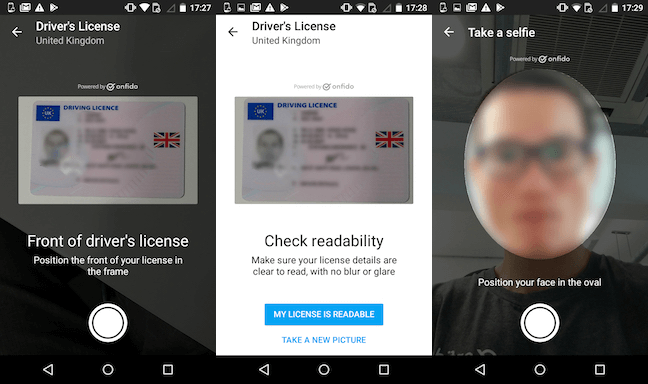

# Onfido Android SDK

Latest version on Bintray: [  ](https://bintray.com/onfido/maven/onfido-capture-sdk/_latestVersion)

## Overview

This SDK provides a drop-in set of screens and tools for Android applications to:

1. Take and evaluate the quality of document and face captures
2. Initialise identity verification checks through Onfido's API

The SDK utilises the Onfido API to evaluate and submit images.  To use the API, an Onfido API token is required.



## Setup

The SDK supports API level 16 and above ([distribution stats](https://developer.android.com/about/dashboards/index.html))

### 1. Adding the SDK dependency

You can download a JAR from Github's [releases page](https://github.com/onfido/onfido-android-sdk/releases)

Alternatively, use Gradle:

```gradle
repositories {
  jcenter()
}

dependencies {
  compile 'com.onfido.sdk.capture:onfido-capture-sdk:+'
}
```

Note:

Until this package gets approved to be included in JCenter, the following snippet must be used to instruct gradle to search for it on Bintray:

```gradle
repositories {
  maven {
    url  "https://dl.bintray.com/onfido/maven"
  }
}
```

### 2. Specifying your API token

In your AndroidManifest.xml file, in your root project, add:

```xml
<application>
  <meta-data android:name="onfido_api_token" android:value="<your token>"/>
  <!-- and so on -->
</application>
```

Your API token is available on the [Settings](https://onfido.com/dashboard/settings/api) page of the Onfido dashboard.

## Usage

### 1. Get an Onfido client instance

To use the SDK, you need to obtain an instance of the client object:

```java
final Context context = ...;
Onfido onfido = OnfidoFactory.create(context).getClient();
```

### 2. Create the SDK configuration

The SDK provides several configuration options.  These are detailed below.

```java
final OnfidoConfig config = OnfidoConfig.builder()
            .withShouldCollectDetails(true)
            .withAsyncCheck(false)
            .withSyncWaitTime(30) //seconds
            .withApplicant(applicant)
            .build();
```

##### `withShouldCollectDetails(boolean)`
Determines whether the SDK will collect applicant details from the user, such as name and address

##### `withAsyncCheck(boolean)`
Determines whether the check will be processed asynchronously.  Not to be confused with an async network call, as every call is asynchronous.

##### `withSyncWaitTime(int)`
Specify (in seconds) how long the SDK should wait for an answer from the server when doing a synchronous check.

##### `withApplicant(Applicant)`
When `withShouldCollectDetails` is `false`, then you must provide applicant details to the SDK.

The following code shows an example of how to create an Applicant object:

```java
Applicant applicant = Applicant.builder()
            .withFirstName("User")
            .withLastName("Last name")
            ...
            .build();
```

Depending on the reports you wish to request, you may also want to add an address for the applicant.

```java
Address address = Address.builder()
            .withFlatNumber("15")
            .withCountry(Locale.UK)
            .withPostcode("FR4 333")
            .withTown("London")
            ...
            .build();

List<Address> list = new LinkedList<>();
list.add(address);

applicant.setAddresses(list);
```

### 3. Start the SDK flow

To start the SDK flow, you should first obtain an *Intent* from the client and use it to start the SDK's activity that runs the background check process. We recommend using **startActivityForResult** to receive the result of the process (to know if the user finished or cancelled the check process).

An example of how to start the process from your app's Activity:

```java
// get client instance
final Onfido onfido = OnfidoFactory.create(this).getClient();
// create your config
final OnfidoConfig config = ...

final Intent intent = onfido.createIntent(config);

// customise the intent if necessary
...

// start the flow. 1 should be your request code (customise as needed)
startActivityForResult(intent, 1);
```

To receive the result from the check flow/process, you should override the method **onActivityResult**.

If your check was processed synchronously, the Check object, which contains the result state, can be extracted using the method **extractCheckResult**:

```java
@Override
protected void onActivityResult(int requestCode, int resultCode, Intent data) {
    ...
    if (requestCode == 1) { // customise as needed
        if (resultCode == RESULT_OK) {
            final Check check = onfido.extractCheckResult(data);
            // Success: user finished the flow. Check the result object
        } else {
            // Failed: user cancelled the flow
        }
    }
    ...
}
```

*TODO: document different result conditions*

From those examples you can see that we used two methods that are provided by the Onfido class:

##### `createIntent(OnfidoConfig)`
Creates an Intent to start the Activity that will run the background check. You should provide an OnfidoConfig class with the SDK configuration.

##### `extractCheckResult(Intent)`
You should use this method to extract the result (Check object) of the background check.

### 4. Callbacks and Results

If you've elected to process checks asynchronously, you'll need to setup a webhook on your backend to receive these results and process them appropriately.

You can register to (receive webhook events)[https://onfido.com/documentation#webhooks] using the Onfido API.  These can also be configured on the Onfido dashboard.

## More Information

Further information about the underlying Onfido API is available in our documentation [here](https://onfido.com/documentation).
